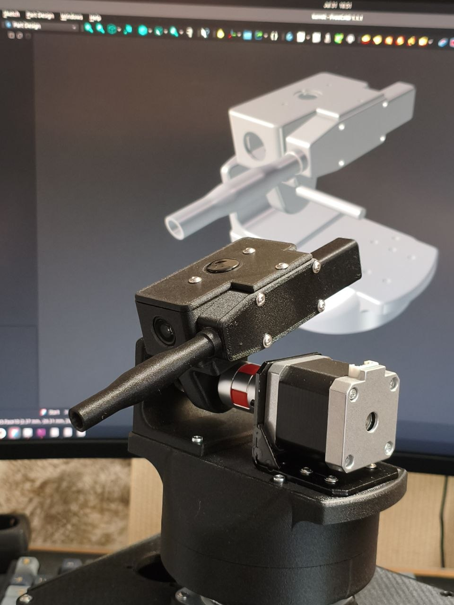
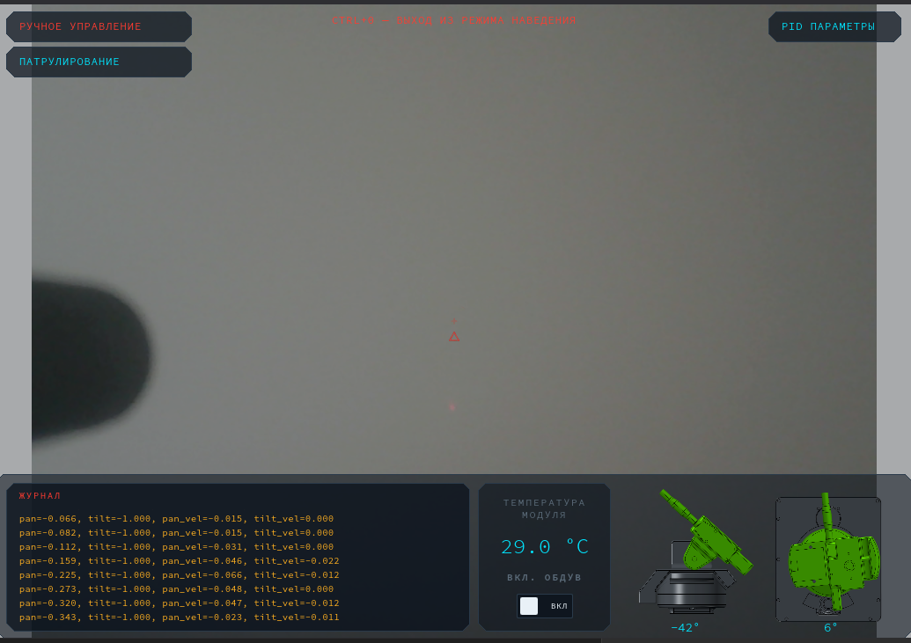
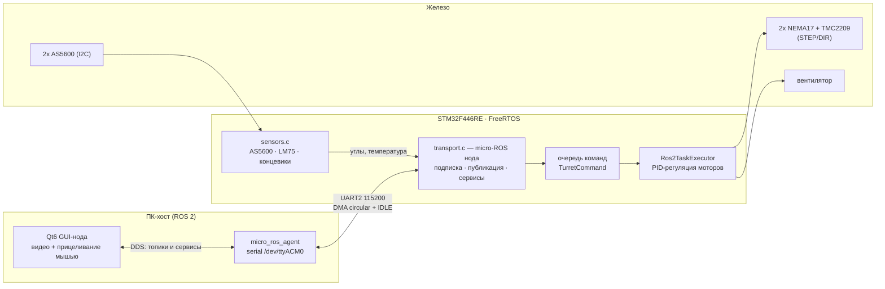

<div align="center">

# proto_turret

**Панорамно-наклонная турель на STM32F446RE под управлением ROS 2 (micro-ROS)**




</div>

---

## О проекте

**proto_turret** — двухосевая турель (панорама + наклон), которая управляется через ROS 2.
Прошивка STM32 построена на **FreeRTOS** и **micro-ROS**: плата становится полноценной нодой
ROS-сети, обмениваясь сообщениями с ПК через UART (DMA + IDLE-прерывание).

На хосте работает Qt6-приложение: получает видео с USB-камеры, рисует прицельный интерфейс,
а движение мыши превращает в команды положения для турели.



## Возможности

- 2 оси (pan/tilt) на шаговых двигателях NEMA17 с драйверами TMC2209 (STEP/DIR)
- Замкнутая обратная связь: магнитные энкодеры **AS5600** по каждой оси (I2C)
- **Автокалибровка** обеих осей по концевикам одним вызовом ROS-сервиса
- **PID-регуляция** скорости с раздельными коэффициентами на каждую ось,
  настройка всех 14 параметров **в рантайме** через ROS-сервис
- Телеметрия: углы осей, состояние 4 концевиков, температура (**LM75**, I2C)
- Управление охлаждающим вентилятором прямо из команды движения
- Аппаратная защита: моторы отключены до подключения агента; стоп при отсутствии
  команд дольше 100 мс; таймаут калибровки по числу шагов
- Полностью 3D-печатный корпус (FreeCAD-модели и STL приложены)

## Архитектура



**Как это работает при загрузке:**

1. Плата стартует с **выключенными** драйверами моторов (EN = HIGH).
2. Главный цикл пингует micro-ros-agent каждые 2 секунды (светодиод мигает — ждём).
3. Агент найден → создаётся нода `proto_turret_node`: подписчик команд, публикаторы
   телеметрии, сервисы калибровки и PID-параметров.
4. Второй поток (`Ros2TaskExecutor`) разбирает очередь команд и ведёт оси по PID.
   Если команды перестали приходить более чем на 100 мс — моторы останавливаются.
5. По запросу сервиса `/turret_calibrate` турель едет до концевиков каждой оси,
   считает шаги полного хода и принимает середину за ноль градусов.

## Железо

| Компонент | Модель | Подключение |
|---|---|---|
| Плата | NUCLEO-F446RE (STM32F446RE, Cortex-M4 @ 180 МГц) | USB (ST-Link + VCP) |
| Моторы | 2× NEMA17 | STEP/DIR (TIM10/TIM11) |
| Драйверы | 2× TMC2209 | STEP/DIR + EN (GPIO) |
| Энкодеры | 2× AS5600 | I2C1 (400 кГц) / I2C2 (100 кГц) |
| Датчик температуры | LM75 | I2C3 (100 кГц) |
| Концевики | 4 шт (лево/право, перед/зад) | GPIO |
| Вентилятор | — | GPIO |
| Камера | любая USB | хост-ПК |
| Канал связи | UART2, 115200 бод, DMA circular 2048 Б + IDLE | micro-ROS |

## Прошивка

Исходники — в [`Core/Src`](Core/Src). Проект генерируется CubeMX ([`proto_turret.ioc`](proto_turret.ioc)),
сборка через Makefile (arm-none-eabi-gcc, hard-float).

| Модуль | Назначение |
|---|---|
| [`transport.c`](Core/Src/transport.c) | весь micro-ROS: инициализация ноды, подписчик, публикаторы, сервисы, ping агента |
| [`turret_tasks.c`](Core/Src/turret_tasks.c) | потоки FreeRTOS, очередь команд, автокалибровка осей |
| [`motor_control.c`](Core/Src/motor_control.c) | STEP/DIR управление TMC2209, PID, движение до концевика |
| [`pid_struct.c`](Core/Src/pid_struct.c) | шаг PID-регулятора (сглаживание скорости, лимит разгона) |
| [`sensors.c`](Core/Src/sensors.c) | чтение AS5600 и LM75, медианный фильтр, восстановление зависшей I2C-шины |
| [`constants.h`](Core/Inc/constants.h) | все настраиваемые константы прошивки в одном файле |

Все настройки ROS-имён, PID, таймингов — в [`constants.h`](Core/Inc/constants.h).

### Потоки FreeRTOS

| Поток | Что делает |
|---|---|
| `defaultTask` (`StartDefaultTask`) | пинг агента → init micro-ROS → цикл `spin_some` + публикация телеметрии |
| `ros2TaskExecutor` | ждёт команду из очереди (таймаут 100 мс), двигает моторы по PID, включает вентилятор |

## ROS-интерфейс

Нода: **`/proto_turret_node`**

Кастомные сообщения и сервисы живут в пакете
[`microros_component/extra_packages/proto_turret_interfaces`](microros_component/extra_packages/proto_turret_interfaces)
и подхватываются при сборке libmicroros.

### Топики

| Направление | Имя | Тип | Частота |
|---|---|---|---|
| подписка | `/proto_turret_cmd` | `proto_turret_interfaces/msg/TurretCommand` | по мере прихода |
| публикация | `/proto_turret_stm32_publisher` | `proto_turret_interfaces/msg/TurretStatus` | 4 Гц |
| публикация | `/proto_turret_as5600` | `std_msgs/msg/Int32MultiArray` | 10 Гц |

```text
# TurretCommand.msg — команда от GUI
float32 pan_pos       # цель по панораме
float32 tilt_pos      # цель по наклону
float32 pan_vel
float32 tilt_vel
bool fan_enable       # включить вентилятор
```

```text
# TurretStatus.msg — телеметрия платы
uint8 switch_mask     # биты 0..3: левый, правый, передний, задний концевики
float32 temperature   # LM75, °C
bool fan_enable
int32 pan_angle       # текущий угол панорамы
int32 tilt_angle      # текущий угол наклона
```

`Int32MultiArray` на `/proto_turret_as5600` — сырые отсчёты энкодеров `[M1, M2, ошибки]`
(0..4095, `-1` = нет ответа) для отладки.

### Сервисы

| Имя | Тип | Назначение |
|---|---|---|
| `/turret_calibrate` | `proto_turret_interfaces/srv/TurretCalibrate` | автокалибровка обеих осей по концевикам, ответ `success` |
| `/turret_pid_params` | `proto_turret_interfaces/srv/PidParams` | применение 14 PID-коэффициентов (kp/ki/kd/smooth/rate/corr_max/speed_max × 2 оси) без перепрошивки |

## Сборка и запуск

### Что понадобится

- **Docker** — для сборки `libmicroros.a`
- **arm-none-eabi-gcc** + make — для сборки прошивки (либо всё то же в Docker)
- **OpenOCD** + ST-Link — для прошивки
- **ROS 2** на хосте и собранный из исходников `micro_ros_agent`
- ROS 2 дистрибуции: библиотека micro-ROS собрана под Humble, хост-стек — Lyrical

### Сборка прошивки

```bash
git clone https://github.com/v-str/proto_turret.git
cd proto_turret

# 1. libmicroros.a в Docker (образ microros/micro_ros_static_library_builder:humble-cached;
#    внутри контейнера также собираются интерфейсы из microros_component/extra_packages)
./build_lib_docker.sh

# 2. Прошивка
make -j$(nproc)            # результат: build/proto_turret.hex/.bin/.elf
# либо полностью в Docker: ./build_fw_docker.sh

# 3. Прошивка платы через ST-Link (program + verify + reset)
./flash_stm32.sh
```

> Плата живёт в закрытом корпусе, поэтому кнопки Reset нажать нельзя — скрипт
> прошивки сам перезапускает МК через OpenOCD, а прошивка после старта сама
> терпеливо ждёт появления агента.

### Запуск на хосте

```bash
# 4. micro-ros-agent (нативно, не в Docker — так надёжнее для DDS)
./agent_start_native.sh

# 5. В другом терминале
source /opt/ros/lyrical/setup.bash
ros2 node list                          # → /proto_turret_node
ros2 topic echo /proto_turret_stm32_publisher

# 6. Откалибровать обе оси (поедет до концевиков и вернётся в центр)
ros2 service call /turret_calibrate proto_turret_interfaces/srv/TurretCalibrate "{}"

# 7. Подёрнуть турель вручную
ros2 topic pub --once /proto_turret_cmd proto_turret_interfaces/msg/TurretCommand \
  "{pan_pos: 0.3, tilt_pos: 0.0, pan_vel: 0.0, tilt_vel: 0.0, fan_enable: false}"
```

## Механика

Корпус и узлы турели спроектированы в FreeCAD — исходники в [`freecad/`](freecad),
готовые к печати STL (43 детали) — в [`freecad/stl/`](freecad/stl):

- `turret.FCStd` — основной корпус: колпак, дверца, ствол, капоты моторов, Y-сочленение
- `bottom_rails.FCStd` — нижние направляющие и углы
- `as5600_plate.FCStd` — крепление энкодеров AS5600
- `raspr_plata_holder.FCStd` — держатель распределительной платы

## Структура репозитория

```text
proto_turret/
├── Core/                        # исходники прошивки (main, задачи, транспорт, моторы, датчики)
├── Drivers/, Middlewares/       # HAL STM32 + CMSIS, FreeRTOS
├── micro_ros_stm32cubemx_utils/ # интеграция micro-ROS в CubeMX-проект (libmicroros.a)
├── microros_component/
│   └── extra_packages/
│       └── proto_turret_interfaces/   # кастомные msg/srv ROS
├── freecad/                     # 3D-модели (FreeCAD) и STL для печати
├── media/                       # фото и скриншоты
├── proto_turret.ioc             # проект CubeMX
├── Makefile                     # сборка прошивки (arm-none-eabi-gcc)
├── build_lib_docker.sh          # сборка libmicroros.a в Docker
├── build_fw_docker.sh           # сборка прошивки в Docker
├── flash_stm32.sh               # прошивка через OpenOCD + ST-Link
└── agent_start_native.sh        # запуск micro-ros-agent на хосте
```

## Статус

- [x] Транспорт micro-ROS: UART2 DMA + IDLE, автоматическое переподключение к агенту
- [x] Управление двумя осями STEP/DIR
- [x] Автокалибровка по концевикам
- [x] Энкодеры AS5600 с фильтрацией скачков
- [x] PID-регуляция + runtime-настройка через ROS-сервис
- [x] Телеметрия: концевики, температура LM75, углы осей
- [x] Qt6 GUI на хосте: видео, прицеливание мышью, PID-панель
- [ ] Лазерный целеуказатель (GPIO)

---

<div align="center">
Собрано на коленке, но с DDS-discovery.
</div>
